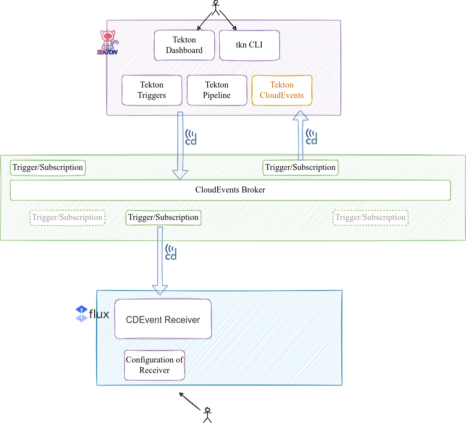
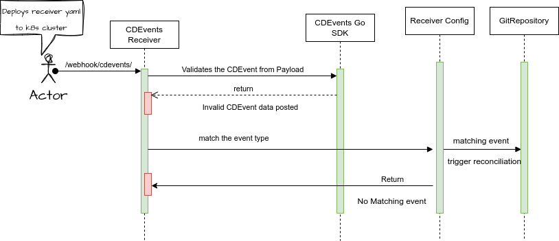
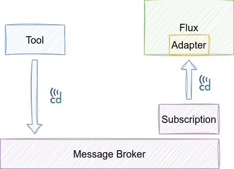

# RFC-0006 Flux CDEvents Receiver

**Status:** provisional

<!--
Status represents the current state of the RFC.
Must be one of `provisional`, `implementable`, `implemented`, `deferred`, `rejected`, `withdrawn`, or `replaced`.
-->

**Creation date:** 2023-12-08

**Last update:** 2024-03-13

## Summary

This RFC proposes to add a `Receiver` type to the Flux notification-controller API
for handling [CDEvents](https://cdevents.dev/).

For `Receiver` objects configured to accept CDEvents,
notification-controller will verify the events sent to the receiver's webhook URL,
check that their type matches the expected type, and trigger the reconciliation
of the configured resources.

## Motivation

CDEvents enables interoperability between CI/CD tools in a workflow, and Flux is a
very popular continuous delivery tool, and consequently the CDF team received many questions
about integrating CDEvents with Flux. 

### Goals

Allow Flux to receive CDEvents and trigger the reconciliation of resources based on the received events.

### Non-Goals

Make the Flux controllers emit CDEvents.

## Proposal

Add CDEvents to the list of available receivers in Flux notification-controller.
Similar to other receivers such as GitHub, Flux users will be able to use `spec.events`
in order to specify which event types the receiver will allow.
The receiver will also verify using the [CDEvents Go SDK](https://github.com/cdevents/sdk-go) that the
payload sent to the webhook URL is a valid CDEvent.

### User Stories

Users of multiple CI/CD tools such as Tekton and Flux
could use CDEvents as a way to enable interoperability.

For example, a user may want a Flux resource to reconcile as part of a Tekton `pipeline`.
The Tekton `pipeline` will fire off a CDEvent to the CloudEvents Broker.
A subscription that the user will have set up externally, e.g. with the [knative broker](https://knative.dev/docs/eventing/brokers/), will then
send a relevant CDEvent to the Flux webhook receiver endpoint. 



### Alternatives

Certain use cases for CDEvents could be done alternatively using
available receivers such as the generic webhook.

## Design Details

Adding a Flux `Receiver` for CDEvents that works much like the other event-based receivers already implemented.

The user will be able to define a Flux `Receiver` custom resource and deploy it to their cluster.
The receiver takes the payload sent to the webhook URL by an external events broker,
checks the headers for the event type, and filters out events based on the user-defined
list of events in `spec.events`. If left empty, it will act on all valid CDEvents.
It then validates the payload body using the [CDEvents Go SDK](https://github.com/cdevents/sdk-go).
Valid events will then trigger the reconciliation of all Flux objects specified in `.spec.resources`.

The CDEvents broker is not a part of this design and is left to the users to set up however they wish.

Example Receiver:

```yaml
apiVersion: notification.toolkit.fluxcd.io/v1
kind: Receiver
metadata:
  name: cdevents-receiver
  namespace: flux-system
spec:
  type: cdevents
  events:
    - "dev.cdevents.change.merged"
  secretRef:
    name: receiver-token
  resources:
    - apiVersion: source.toolkit.fluxcd.io/v1
      kind: GitRepository
      name: webapp
      namespace: flux-system
```






## Implementation History

<!--
Major milestones in the lifecycle of the RFC such as:
- The first Flux release where an initial version of the RFC was available.
- The version of Flux where the RFC graduated to general availability.
- The version of Flux where the RFC was retired or superseded.
-->
